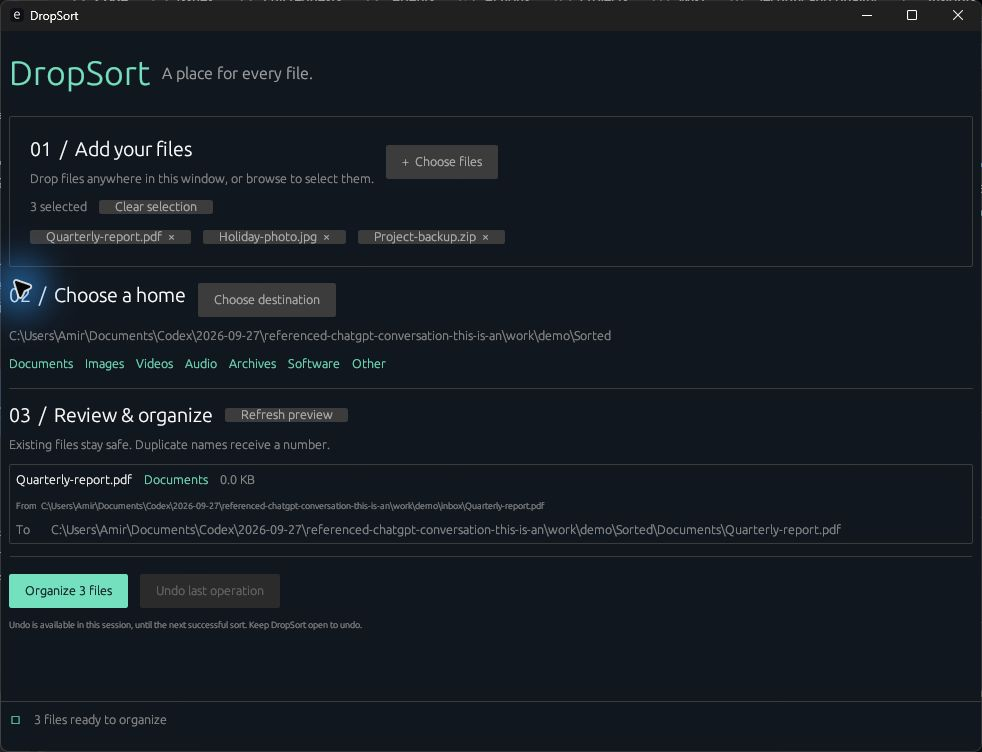

# DropSort

**A place for every file.** A small, local Windows app built with Rust: select or drop files, preview where they will go, and organize them with one click.



## What it does

- Add multiple files with the native file picker or drag them onto the window.
- Choose a destination folder and inspect every source and destination before confirming.
- Sort by extension into **Documents / Images / Videos / Audio / Archives / Software / Other**.
- Resolve duplicate names in the preview: `report.pdf` → `report (1).pdf`.
- Move without replacing existing files, including destinations created after the preview.
- Undo the last batch during the current session. Modified files and occupied original paths are protected.
- Keep the interface responsive while files move. No account, upload, analytics, or network access at runtime.

## Install & run

**Requirements:** Windows 10/11, 64-bit, with a graphics driver supporting OpenGL 3.3.

DropSort is portable; it does not require an installer or administrator rights.

1. Open this repository's **Actions → Windows** workflow.
2. Select a successful run for the version you want and download **DropSort-windows-x64** (GitHub sign-in may be required).
3. Extract the archive and run `dropsort.exe`.

The executable is currently unsigned. If your organization blocks unsigned applications, build from source or follow your organization's software approval process.

## Use

1. **Add your files.** Choose files or drag files from Explorer onto the window. Click a selected filename to remove it, or clear the selection.
2. **Choose a home.** Select the parent folder for the seven categories. For example, choosing `D:\Sorted` sends PDFs to `D:\Sorted\Documents`.
3. **Review & organize.** Review the exact paths, click **Organize**, then **Move files**. Nothing moves before confirmation.
4. **Undo last operation** restores the last batch to its original locations. Keep the app open if you might want to undo.

You can also pass file paths when launching the app:

```powershell
.\dropsort.exe "C:\Users\You\Downloads\report.pdf" "C:\Users\You\Downloads\photo.jpg"
```

### Categories

| Folder | Example extensions |
| --- | --- |
| Documents | pdf, docx, xlsx, pptx, txt, md, csv, epub |
| Images | jpg, png, gif, webp, svg, heic, avif |
| Videos | mp4, mkv, mov, avi, webm |
| Audio | mp3, wav, flac, aac, m4a, opus |
| Archives | zip, rar, 7z, tar, gz, xz, zst |
| Software | exe, msi, msix, appx |
| Other | Unknown extensions and extensionless files |

Matching is case insensitive. Classification uses the final extension, not the file's contents. Selecting a `.exe` never executes it. The complete mapping lives in `src/lib.rs`.

## Safety & limitations

- Windows `MoveFileExW` is called **without** `REPLACE_EXISTING`. Conflicting targets fail instead of overwriting data. Refresh the preview to select a newly numbered name.
- Moves to another drive use Windows' copy-and-delete behavior with `COPY_ALLOWED` and `WRITE_THROUGH`. They are **not atomic**. A failure or interruption may leave two copies; inspect the reported paths before retrying. If Windows keeps the original, DropSort reports that fact and stops the batch.
- A batch stops at its first error. Earlier successful moves remain undoable; no batch-wide atomicity is promised.
- Undo checks a SHA-256 fingerprint and refuses to restore a file whose contents changed. Failed undo entries remain available for retry. Undo never replaces a recreated original file.
- **Undo history lives in memory.** Closing the app or starting another successful sort loses the previous history. The confirmation explains when history will be replaced. Normal closing is disabled while a worker is moving files; terminating the process or power loss cannot be prevented.
- Only regular local files are supported. Directories, symbolic links, junction targets in category folders, and reparse-point files (including some cloud placeholders) are rejected. Download cloud files to an ordinary local folder first.
- Files already in the correct category are skipped. Empty category directories are not removed by Undo. Missing original parent folders must be recreated before retrying Undo.
- Avoid editing selected files or changing their folders while sorting or undoing. Checks cannot eliminate all races with other programs. Backups remain useful, especially for removable or network storage.
- The MVP interface is English. Windows paths are preserved as Unicode; custom rules, persistent undo, recursive folder sorting, and content recognition are not included.

## Build from source

Install [Rust](https://www.rust-lang.org/tools/install) and the Microsoft C++ Build Tools with **Desktop development with C++** and a Windows SDK. Use the default `x86_64-pc-windows-msvc` toolchain.

```powershell
git clone https://github.com/Amirnemati13/DropSort.git
cd DropSort
cargo build --release --locked
.\target\release\dropsort.exe
```

Alternatively, the `x86_64-pc-windows-gnu` Rust toolchain works with a compatible 64-bit MinGW-w64 compiler on `PATH`.

```powershell
rustup component add rustfmt clippy
cargo fmt --all -- --check
cargo clippy --locked --all-targets -- -D warnings
cargo test --locked
```

`Cargo.lock` is committed for repeatable dependency selection. Build products, credentials, and local environment files are ignored. The Windows workflow runs formatting, linting, tests, and a release build, then uploads the executable as an artifact.

## Project layout

```text
src/lib.rs          Classification, planning, protected moves, undo, filesystem tests
src/main.rs         egui desktop UI and background worker
docs/              Screenshot and validation notes
.github/workflows/  Windows checks and portable executable artifact
```

The project uses [egui/eframe](https://github.com/emilk/egui) for the interface, [rfd](https://github.com/PolyMeilex/rfd) for native file dialogs, and Windows filesystem APIs for moves.

## فارسی

DropSort یک برنامهٔ کوچک ویندوزی برای مرتب‌سازی فایل‌هاست. فایل‌ها را انتخاب کنید یا داخل پنجره بیندازید، پوشهٔ مقصد را انتخاب کنید و مسیرهای پیشنهادی را ببینید. انتقال فقط بعد از تأیید انجام می‌شود. فایل‌های هم‌نام جایگزین نمی‌شوند و آخرین عملیات تا وقتی برنامه باز است قابل بازگردانی است. اگر فایل بعد از انتقال ویرایش شده باشد، Undo از بازگرداندن آن خودداری می‌کند.

## License

[MIT](LICENSE) — Copyright © 2026 Amir Nemati. Dependencies retain their respective licenses.
